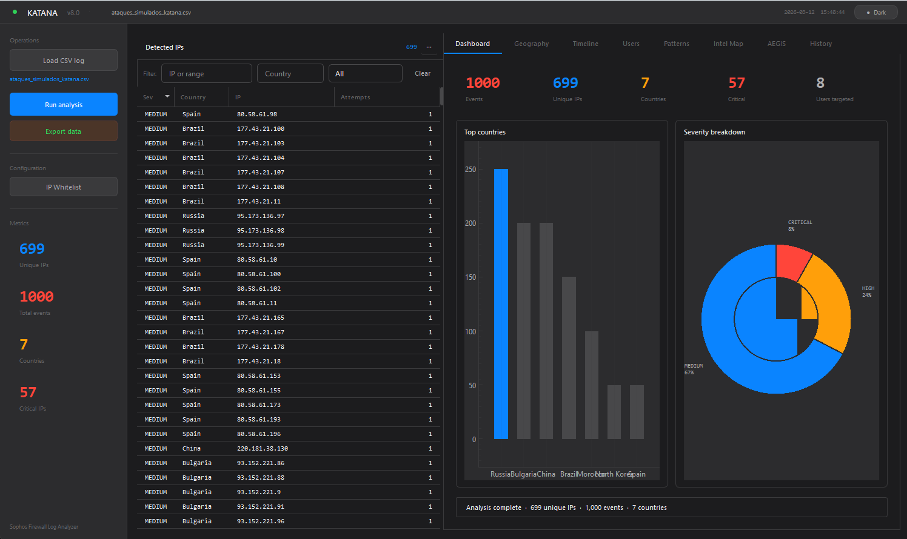
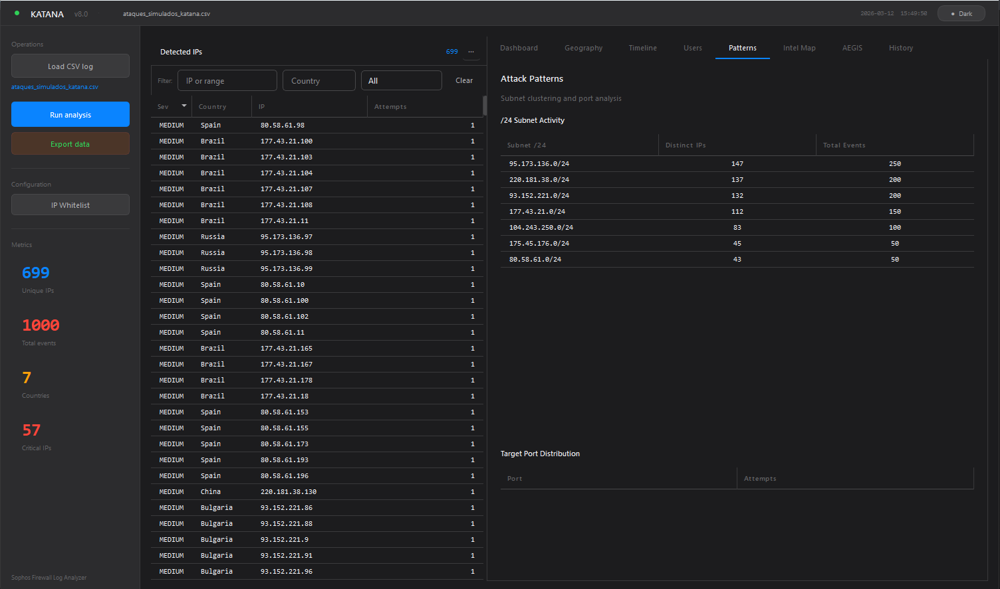
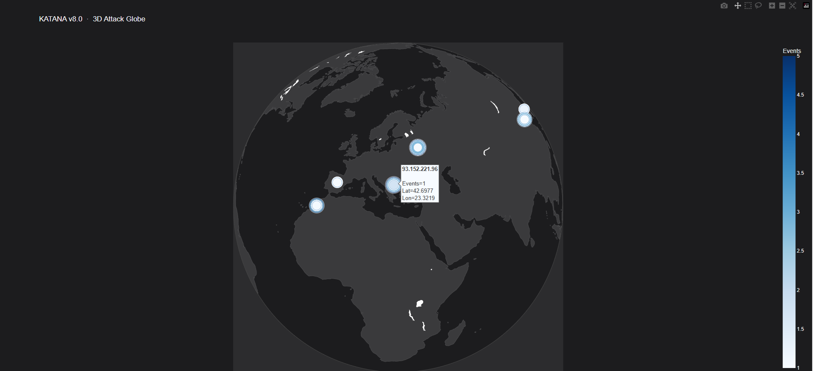
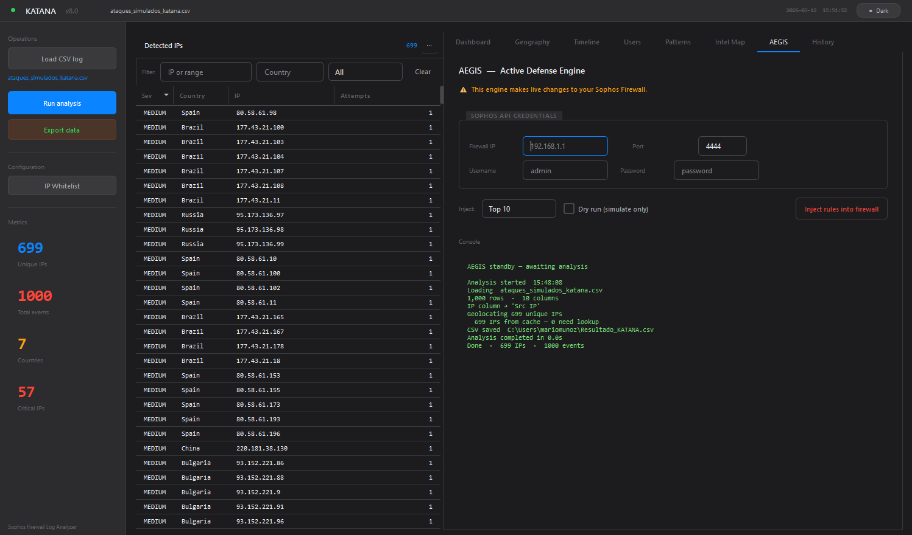

<h1 align="center">⚔️ KATANA v8.0 Threat Intelligence Platform</h1>
<h3 align="center">Advanced SOC Analysis & Active Defense for Sophos Firewalls</h3>

<p align="center">


</p>

---

# ⚔️ KATANA v8.0 — Overview

KATANA is a **commercial-grade Threat Intelligence and Active Defense platform** designed for **SOC analysts, incident responders, and cybersecurity architects**.

The tool parses raw **Sophos Firewall logs**, extracts attacker intelligence, visualizes attack vectors via native Qt graphics, generates executive PDF reports, and can **actively mitigate threats by grouping and blocking attackers directly via the Sophos Firewall XML API**.

KATANA bridges the gap between:
* 🔎 **Forensic Log Analysis** (Subnet clustering, user brute-force detection)
* 📊 **Threat Intelligence Visualization** (Time-series analysis, 3D threat globes)
* 📄 **Executive Reporting** (Automated UTF-8 PDF generation)
* 🛡️ **Automated Active Defense** (Direct Sophos API injection)

---

# 🚀 v8.0 Platform Upgrades

The entire core has been rewritten to support enterprise-level workloads without UI freezing or memory bottlenecks.

* **GUI Overhaul (PyQt6):** Transitioned to a robust PyQt6 architecture featuring dynamic light/dark macOS-style themes and lightning-fast rendering.
* **Local Database (SQLite3):** Persistent local storage (`~/.katana_v8.db`) for IP whitelisting, historical analysis tracking, and a 30-day geolocation cache to bypass API rate limits.
* **Native Rendering (PyQtGraph):** Matplotlib has been replaced with `pyqtgraph` for hardware-accelerated, interactive charting (Donuts, Bar charts, Time-series).
* **Multithreaded Data Pipeline:** A safe `QThread` and `ThreadPoolExecutor` architecture ensures the UI remains fully responsive while batch-processing thousands of IOCs.

---

# 🖥️ Application Interface

### Executive Dashboard


### Attack Patterns & Subnet Clustering


### 3D Global Threat Globe


### AEGIS Live Mitigation Console


---

# 🔍 Forensic & Intelligence Features

* **Universal Parser:** Extracts attacker IPs, targeted ports, and usernames via Regex, gracefully handling different Sophos CSV export formats.
* **Pattern Recognition:** Automatically clusters attackers into `/24` subnets to identify coordinated botnet campaigns.
* **Temporal Analysis:** Hourly, Daily, and Weekly attack volume timelines.
* **Geospatial Mapping:** Generates both 2D Choropleth maps and interactive 3D Globes using `Plotly`.
* **Export Engine:** One-click generation of Executive PDFs (`reportlab`), Excel spreadsheets, JSON payloads for SIEM ingestion, and raw IOC text files.

---

# 🛡️ AEGIS Active Defense Engine

AEGIS maintains strict firewall hygiene while blocking adversaries in real-time.

### Smart Grouping Technology
Instead of polluting the firewall with scattered IP objects, AEGIS automatically creates and updates a single `IPHostGroup` named **`KATANA_BLACKLIST`**. Administrators only need to configure a single drop rule for this group.

### Capabilities
* Direct Sophos Firewall XML/REST API integration.
* Automated IP Host creation and Group consolidation.
* "Dry Run" mode for safe simulation.
* Threshold targeting (Top 10, Top 50, Top 100, or All IPs).

---

# 📦 Installation

Clone the repository:

```bash
git clone [https://github.com/mario1603b/KATANA.git](https://github.com/mario1603b/KATANA.git)
cd KATANA
````

Install dependencies:

Bash

```
pip install -r requirements.txt
```

---

# ⚙️ Sophos Firewall Configuration

To allow KATANA's AEGIS engine to interact with the firewall:

1. Login to **Sophos WebAdmin**.
    
2. Navigate to: `Administration → Device Access`.
    
3. Enable **API Configuration**.
    
4. Add the **IP address of the machine running KATANA** to the allowed list.
    
5. Create a Firewall Rule at the top of your list dropping traffic from the Source Network: `KATANA_BLACKLIST`.
    

---

# 🧱 Build Portable Executable

You can compile KATANA into a **single portable Windows executable** using PyInstaller.

Bash

```
pyinstaller --noconfirm --onefile --windowed --name "KATANA_v8.0_Platform" main.py
```

_Note: Large data-science libraries (Pandas, Plotly, PyQt6) are bundled inside the `.exe`. The first launch may take 5-10 seconds as Windows decompresses the payload into memory._

---

# 🛠️ Technology Stack

|**Component**|**Technology**|
|---|---|
|**Language**|Python 3.10+|
|**GUI Framework**|PyQt6|
|**Data Processing**|Pandas / NumPy|
|**Native Charts**|PyQtGraph|
|**Web Mapping**|Plotly|
|**Reporting**|ReportLab|
|**Database (Cache/State)**|SQLite3|
|**Concurrency**|QThread / ThreadPoolExecutor|

---

# ⚠️ Disclaimer

The **AEGIS Engine performs direct modifications to firewall configurations**. Use responsibly.

The authors are **not responsible for network outages, firewall misconfigurations, or unintended blocks** caused by automated mitigation. Always test in a **controlled environment** before production use.

---

# 📜 License

MIT License

---

# 👨‍💻 Author

Cybersecurity Research Project by **mario1603b**.

Focus areas: Threat Intelligence | Defensive Security | Security Automation